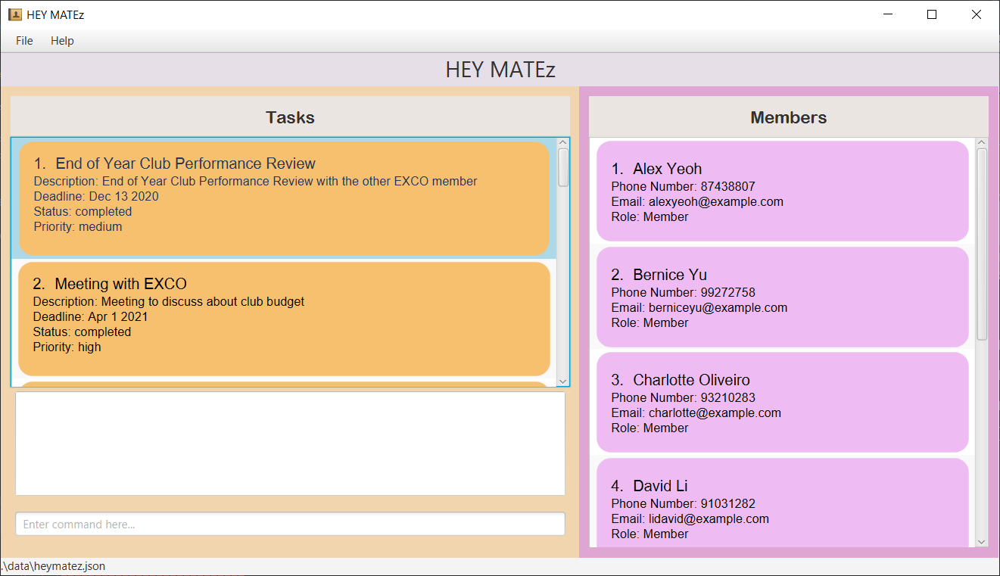

## Introduction
HEY MATEz is a desktop application that allows CCA leaders to track members of
a CCA and tasks that have to be carried out in the CCA. It is
a Command Line Interface (CLI) application while still retaining a Graphical User Interface (GUI)
as this application is catered to students who are used to typing on the keyboard frequently.

--------------------------------------------------------------------------------------------------------------------

## Quick start

1. Ensure you have Java `11` or above installed in your Computer.

1. Download the latest `heymatez.jar` from [here](https://github.com/AY2021S2-CS2103T-W14-3/tp/releases).

1. Copy the file to the folder you want to use as the _home folder_ for your Hey Matez.

1. Double-click the file to start the app. The GUI similar to the below should appear in a few seconds. Note how the app contains some sample data. 
   

1. Type the command in the command box and press Enter to execute it. e.g. typing **`help`** and pressing Enter will open the help window. 
   Some example commands you can try:

   * **`viewMembers`** : Lists all members.

   * **`addTask`**`Wash dishes -d Wash all dishes from dinner -b 2020-01-01` : Adds a task named `Wash dishes` to the Hey Matez.

   * **`deleteTask`**`3` : Deletes the 3rd task shown in the current list.

   * **`clear`** : Deletes all tasks and members.

   * **`exit`** : Exits the app.

1. Refer to the [Features](#features) below for details of each command.

-------------------------------------------------------------------------------------------------------------

## Features

#### Task related commands 
* [Add Task](#Add Task): `addTask`
* Delete Task: `deleteTask`
* View Tasks: `viewTasks`
* Edit Tasks: `editTask`      
* Mark Task as Done: `done` 
* Mark Task as Not Done: `undo`
* Find Tasks by Keywords: `findTasks`
* Find Task by Priority: `findPriority`
* View List of Uncompleted Tasks: `viewUncompletedTasks`

#### Member related commands
* Add Member: `addMember`
* Delete Members’ Details: `deleteMember`
* View Members’ Details: `viewMembers`
* Edit Members’ Details: `editMember`
* Find Members by Keywords: `findMembers`

### General commands
* Exit Application: `exit`
* Clear all data in application: `clear`
* View Help: `help`

### 1. Add Task: `addTask`
Adds a task, with its description and deadline to the list.

Format: `addTask TITLE -d DESCRIPTION -b DEADLINE -s STATUS -p PRIORITY`
* The status and priority fields are optional.
* If status field is not provided, the Task will be assigned a default status value of uncompleted.
* status field can only take on the values completed or uncompleted
* If priority field is not provided, the Task will be assigned a default priority of unassigned.
* status field can only take on the values high, medium or low

Examples: `addTask assignment -d Math quiz 2 -b 2021-04-04 -s completed -p high`

### 2. Delete Task: `deleteTask`
Deletes a task from the list.

Format: `deleteTask INDEX`

Examples: `deleteTask 1`

### 3. View Task: `viewTasks`
Views the list of tasks that the user has added into the application

Format: `viewTasks`

Examples: `viewTasks`

### 4. Edit Task: `editTask`
Edit task details

Format: `editTask INDEX -n NEW TITLE -d NEW DESCRIPTION -b NEW DEADLINE -s NEW STATUS -p NEW PRIORITY`

Examples: `editTask 1 -n Plan meeting -d Plan board meeting -b 2021-04-04 -s high -p high`

* The fields NEW TITLE, NEW DESCRIPTION, NEW DEADLINE, NEW STATUS, NEW PRIORITY are all optional
* Edits the Task at the specified index IN LIST.
* At least one of the optional fields must be provided.
* Existing values will be updated to the input values.

### 5. Mark Task as Done: `done`

Change the status of a task from uncompleted to completed

Format: `done INDEX`

Examples: `done 1`

### 6. Mark Task as Not Done: `undo`

Change the status of a task from completed to uncompleted

Format: `undo INDEX`

Examples: `undo 1`

### 7. Find Tasks by Keywords: `findTasks`

Find all tasks containing any of the specified keywords in its title or description

Format: `findTasks KEYWORD MORE_KEYWORDS`

Examples: `findTasks Meeting Proposal Draft`

### 8. Find Tasks by Priority: `findPriority`

Find all tasks containing the specified priority

Note: The valid input values for `findPriority`: high, medium, low and unassigned (Case sensitive)

Format: `findPriority PRIORITY`

Examples: `findPriority HIGH`

### 9. View List of Uncompleted Tasks: `viewUncompletedTasks`

View the list of uncompleted tasks

Format: `viewUncompletedTasks`

Examples: `viewUncompletedTasks`

### 10. Add Member: `addMember`

Adds a member and his/ her contract number to contact list

Format: `addMember NAME -p PHONE NUMBER -e EMAIL -r ROLE`

Examples: `addMember Dylan -p 64529356 -e test@test.com -r Member`
* The field ROLE is optional
* If role field is not specified, person will be assigned a default role of member.

### 11. Delete Member: `deleteMember`

Delete a member and his/ her contact details from the contact list

Format: `deleteMember NAME`

Examples: `deleteMember Rachel`

### 12. View Member: `viewMembers`

View the list of members the user has added

Format: `viewMembers `

Examples: `viewMembers `

### 13. Edit Member: `editMember`
Edit task details

Format: `editMember NAME IN LIST -n NEW NAME -p NEW PHONE NUMBER -e NEW EMAIL -r ROLE`
* Edits the person at the specified NAME IN LIST.
* The fields NEW NAME, NEW PHONE NUMBER, NEW EMAIL, NEW ROLE are all optional
* At least one of the optional fields must be provided.
* Existing values will be updated to the input values.

Examples: `editMember Alice -n Alice Lim -p 95231156 -e tasha@test.com -r Events head`

### 14. Find Members by Keywords: `findMembers`

Find all members whose details contain any of the specified keywords

Format: `findMembers KEYWORD MORE_KEYWORDS`

Examples: `findMembers Rachel 98562154 john@gmail.com`

### 15. Clear all data in application: `clear`
Clears all entries from the application.

Format: clear

Examples: `clear`

### 16. Exiting the progam: `exit`
Exits the program.

Format: exit

Examples: `exit`

### 17. View Help: `help`
Shows a message explaning how to access the help page.

Format: help

Examples: `help`
